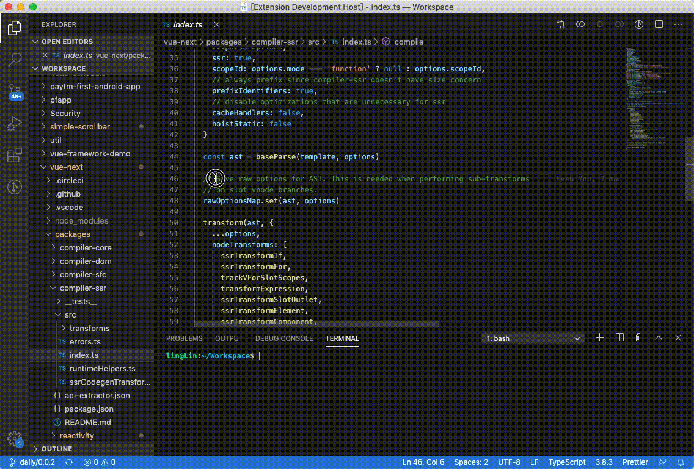

 # vscode-translation

A simple translation extension for VS Code

## How to work

1. Search `Easy Translator` in Extensions
or Open [Easy Translator](https://marketplace.visualstudio.com/items?itemName=preflower.vscode-translation) link
2. Install it

## Extension Settings

This extension contributes the following settings:

* `easy-translator.defaultLanguage`: Translate other languages ​​into this language.
* `easy-translator.covertedLanguage`: If the text language is the same as the default language, convert to that language.
* `easy-translator.dictionary`: Configure available dictionary libraries.

| Configure | Default | Options |
|-|-|-|
| easy-translator.defaultLanguage | zh-cn | en zh-cn pt
| easy-translator.covertedLanguage | en | en(English) zh-cn(Chinese) jap(Japanese) fr(French) ko(Korea): only support in YouDao pt(Portuguese)
| easy-translator.dictionary | ['YouDao', 'Bing', 'Google', 'Linguee'] | YouDao Bing Google Linguee

## Release Notes

### 1.0.0
- Google Added
- YouDao Added
- Linguee Added
- Bing Added
- Add covertedLanguage config
- Add defaultLanguage config
- Add dictionary config
- 因国内问题，Linguee翻译返回会较慢，所以母语设置为'en'会启动Linguee，母语设置为'cn'会启动YouDao、Bing，且词典列中必须有该词典

### 1.1.0
- Portuguese Added (support in Google and Linguee)